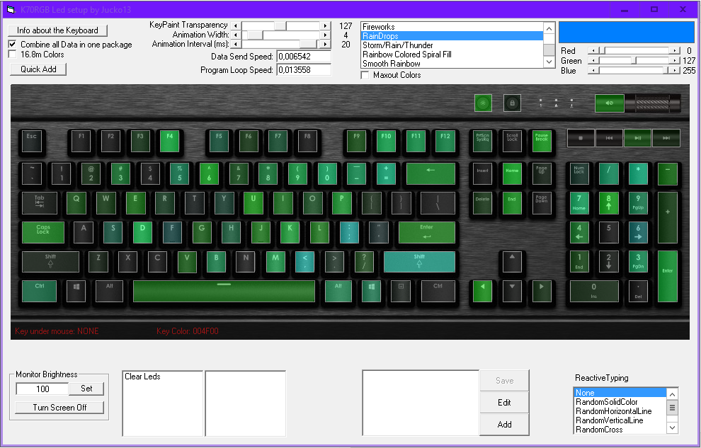
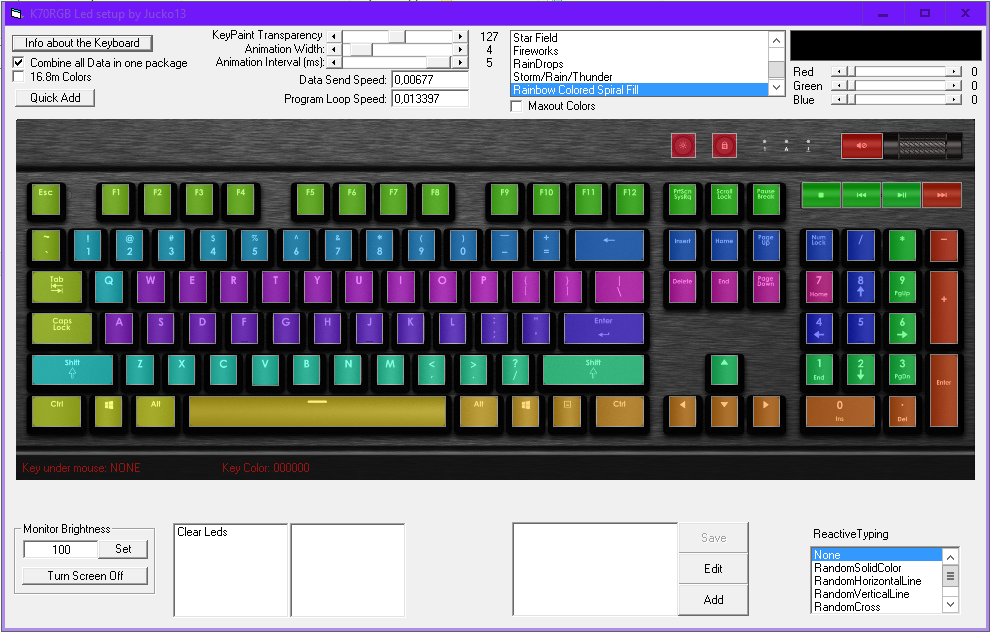
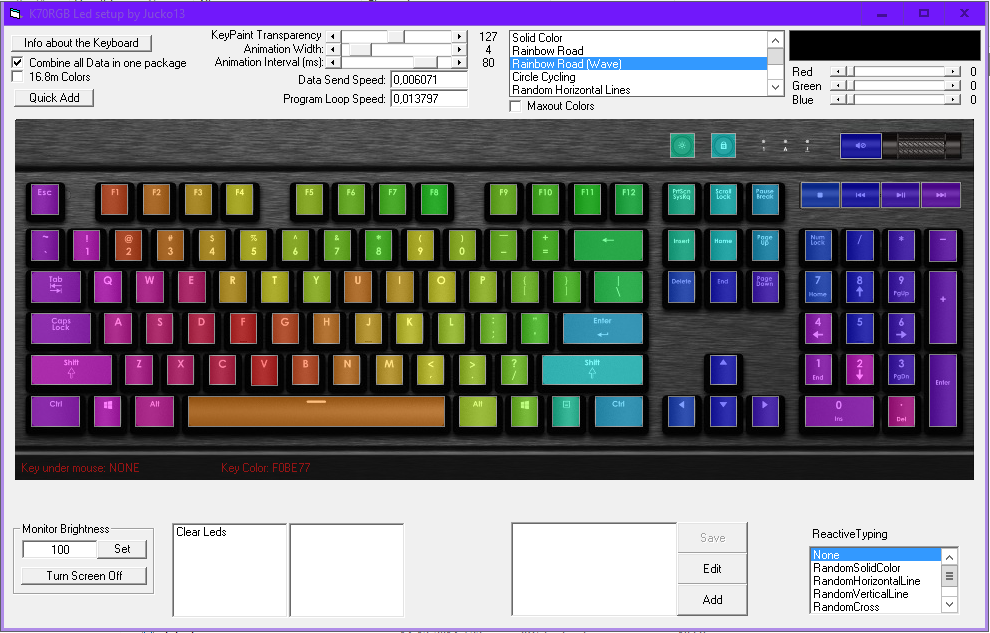
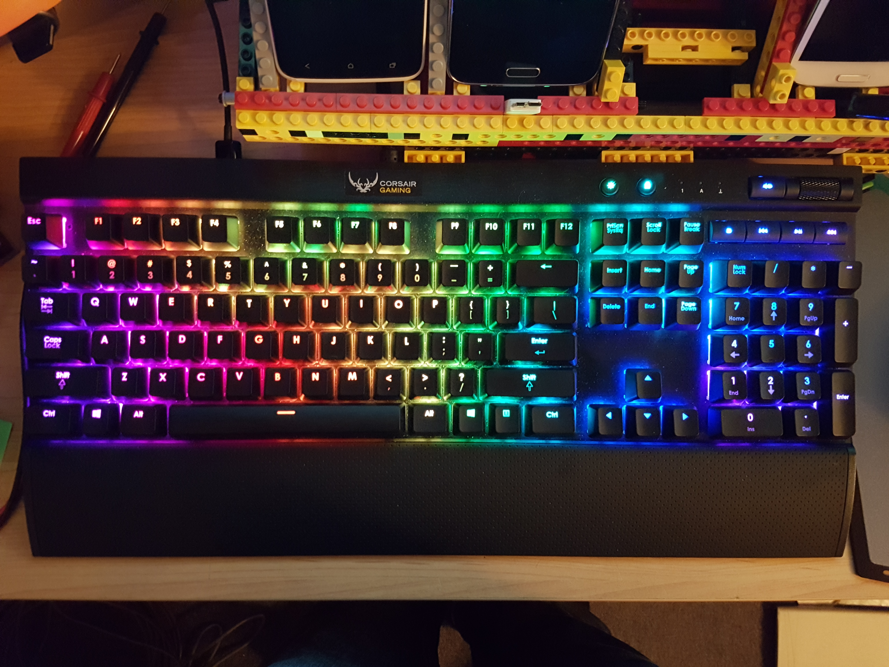
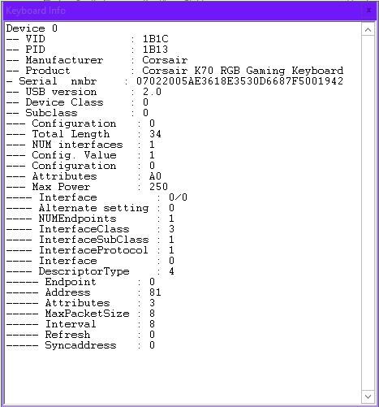

# KeyboardLights
Vb6 version of my Corsair K70RGB Keyboard Backlighting Control

This program is just for visual effects, it can not be used to program macro's on the keys.

I wrote this program in vb6 and did this in a very quick way, the code is thereby not optimized for speed and can be unstable sometimes.
Use at your own risk!

